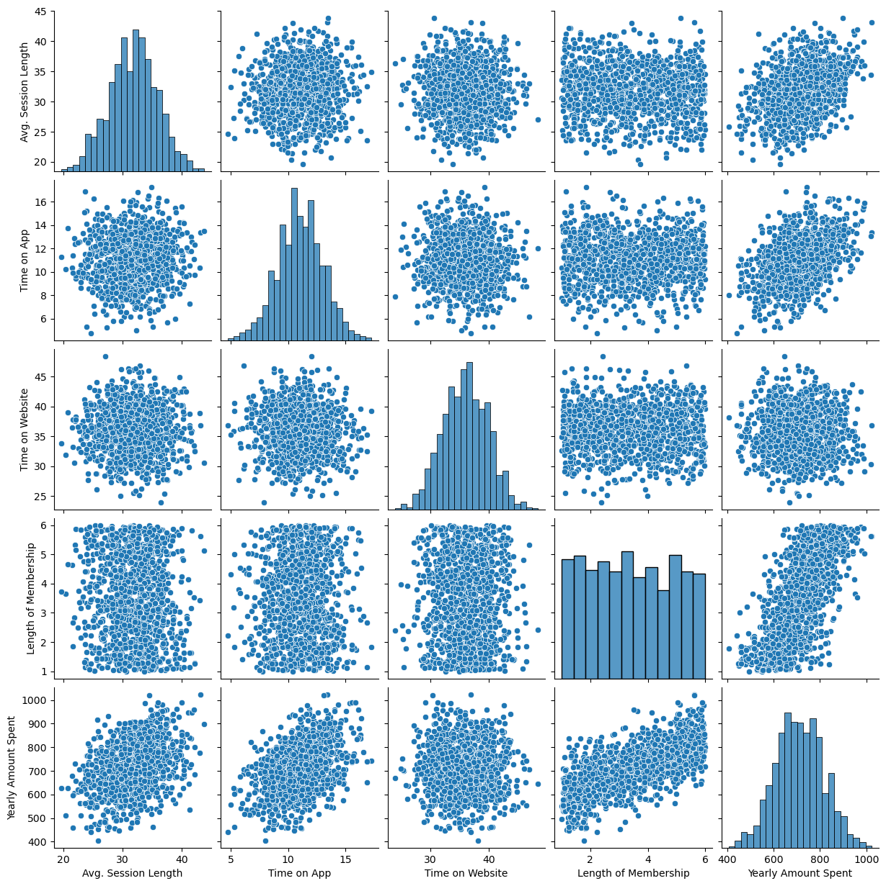
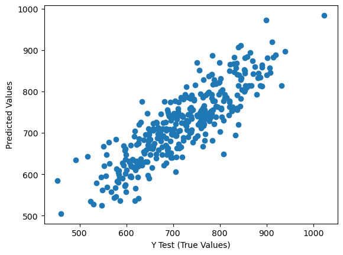
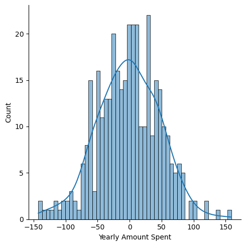

# 📊 Linear Regression Project – Customer Spending Analysis
## 📁 Project Overview

This project applies Linear Regression to analyze customer behavior and predict Yearly Amount Spent based on user activity data from an e-commerce platform.

The goal is to understand:

What drives customer spending
Which platform (App vs Website) performs better
How businesses can optimize revenue

## 📦 Dataset

-   Avg. Session Length
-   Time on App
-   Time on Website
-   Length of Membership
-   Yearly Amount Spent

------------------------------------------------------------------------

## 📁 Project Overview

This project applies **Linear Regression** to analyze customer behavior
and predict **Yearly Amount Spent**.

------------------------------------------------------------------------

## 📸 Project Visuals

### 🔍 EDA - Pairplot

### 📈 Predictions vs Actual

### 📉 Residual Plot

------------------------------------------------------------------------

## 🤖 Model

-   Linear Regression (Scikit-learn)

------------------------------------------------------------------------

## 📈 Evaluation

-   MAE
-   MSE
-   RMSE

-----------------------------------------------------------------------

------------------------------------------------------------------------

## 🚀 Business Impact

## 🎯 Business Decision 

👉 The company should focus more on the mobile app, because:

It has a strong positive impact
Website has no meaningful contribution (even slightly negative)

## 🤔 But cann’t ignore this nuance 

“The negative coefficient for Time on Website suggests potential issues with the website experience. Instead of ignoring it, the company should investigate whether improving the website could unlock additional revenue.”
------------------------------------------------------------------------

## 🛠️ Tech Stack

Python \| Pandas \| NumPy \| Seaborn \| Matplotlib \| Scikit-learn

------------------------------------------------------------------------

## ⭐ Support

If you like this project, give it a ⭐!
